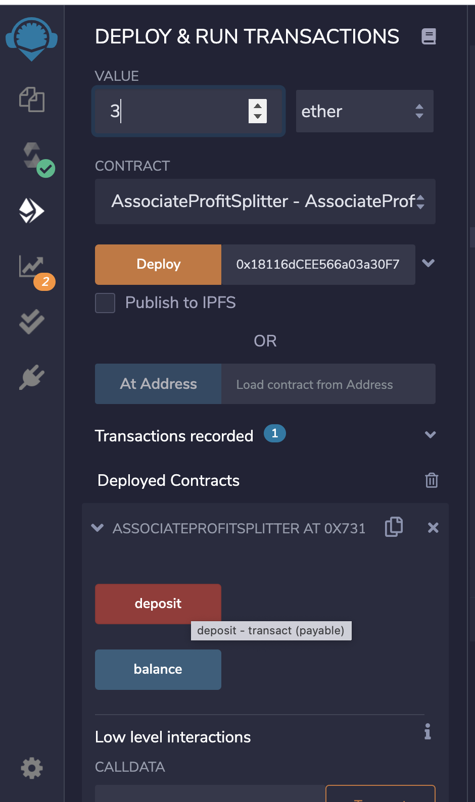
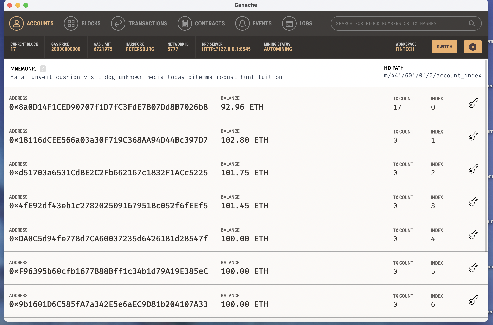

# Unit-20---Looks-like-we-ve-made-our-First-Contract

### Setup employee wallets in Metamask
#### Copy private key from Ganache for 3 x Addresses (3 x employees) 

### Compile and Deploy Contract with 3 x Addresses

### Test Functionality of Profit Splitter using 3 ETH

### Approve in Metamask

### Check wallets in Ganache to make sure deposit split across 3 address equally 

### Deploy Tiered Profit Splitter 

### Test Tiered Profit Splitter 

### Check account balance in Ganache - Works great! 

